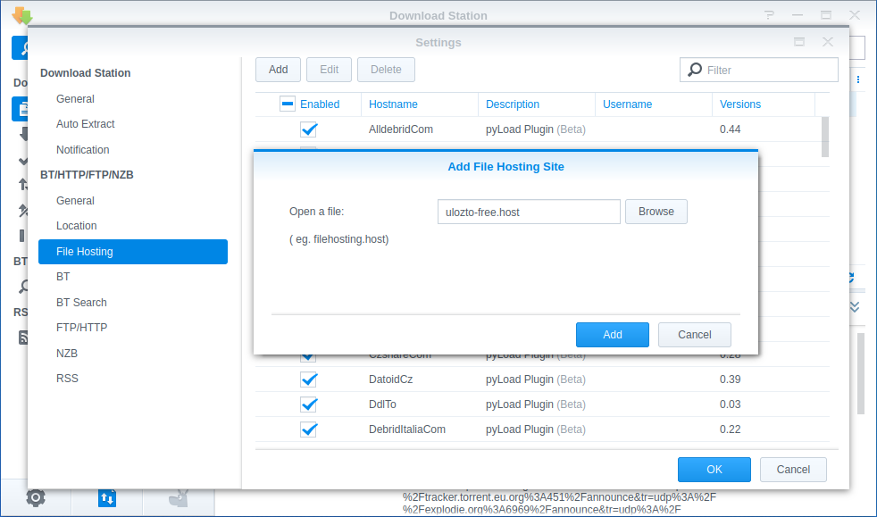
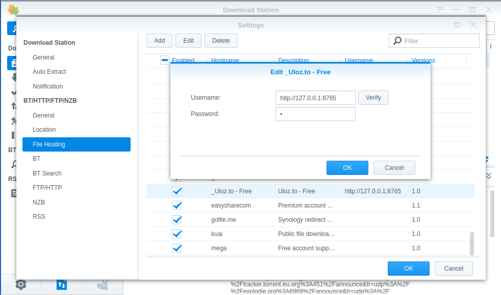

# Ulož.to Streamer Synology

HOST plugin pro Synology Download Station umožňující stahování z uložto bez nutnosti zadání captcha.

## Prekvizity

Pro funkčnost je prekvizitou běžící server [`Ulož.to Streamer`](https://github.com/SpiReCZ/ulozto-streamer/tree/ulozto-streamer)

## Návod na instalaci a nastavení HOST pluginu
1. Otevřít `Download Station` a jít do nastavení
2. Vybrat `File Hosting` a kliknout na `Add`
3. Zvolit HOST file [`ulozto-free.host`](../../releases) a kliknout na `Add`

4. V dostupných `File Hosting` najít `UlozTo` a odškrtnout ve sloupečku `Enabled`. Tím bude deaktivován původní plugin. V případě absence původního pluginu je možné tento krok přeskočit. Pokud by byl nainstalován jiný ulož.to plugin je nutné jej také deaktivovat.
5. V dostupných `File Hosting` najít `_Uloz.to - Free` (obvykle úplně dole), označit a kliknout na tlačítko `Edit`
6. Do políčka `Username` je nutné zadat URL adresu běžícího serveru `Ulož.to Streamer` (Pro server běžící v Dockeru přímo v Synology je možné zadat například `http://127.0.0.1:8765`).
7. Do políčka `Password` je nutné zadat počet částí, které budou stahovány paralelně (Doporučená defaultní hodnota `10`).

## Ladění nastavení

### Počet stahovaných částí a rychlost stahování
Z Uložto je obvyklá rychlost při paralelním stahování `~150-180kB/s` a za různých situací dosáhne `300kB/s` (stahování večer/ráno mimo špičku nebo stahování pouze jedné části).

Pro omezení stahované rychlosti přibližně na `1024kB/s` je při `150kB/s` potřeba stahovat `7` částí paralelně.

## Jak to funguje v praxi

1. Uživatel přidá do Download Station odkaz ke stažení.
2. Download Station zavolá na server `Ulož.to Streamer` požadavek ke stažení souboru.
3. Běží-li na serveru již jiný download (omezeno na 1 download), tak Download Station zkusí zavolat server pozdějí (~60s).
4. Server inicializuje download a Download Station dostane link ke stahování odkazující se na lokální server.
6. Zatímco lokální server stahuje paralelně (například 10 částí rychlostí 1500kB/s), tak Download Station stahuje pouze jednu část současně (150kB/s), jedná se o sériové stahování.
8. Jakmile je stažena první část, tak Download Station vyšší rychlostí dostahuje dostupný obsah, který na pozadí lokální server již stáhl z další části.
9. Většinou po stažení první části je stahování téměř okamžitě dokončené, protože ostatní části jsou také stažené.
10. **Je nutné dát si pozor na omezení rychlosti HTTP stahování v Download Station, protože omezí okamžité stažení ostatních částí.** Toto omezení stahování je tedy ideální vypnout.

### Co nefunguje
- Pauza downloadů
  - V současné době není podporováno. Po pauznutí se stále stahuje na pozadí v serveru a po obnovení si Synology stahuje z lokálního serveru soubor znovu.
- Smazání downloadů
  - Download je smazán pouze v Synology, server stahuje soubor dál (tu je možné restartovat pro vypnutí stahování).